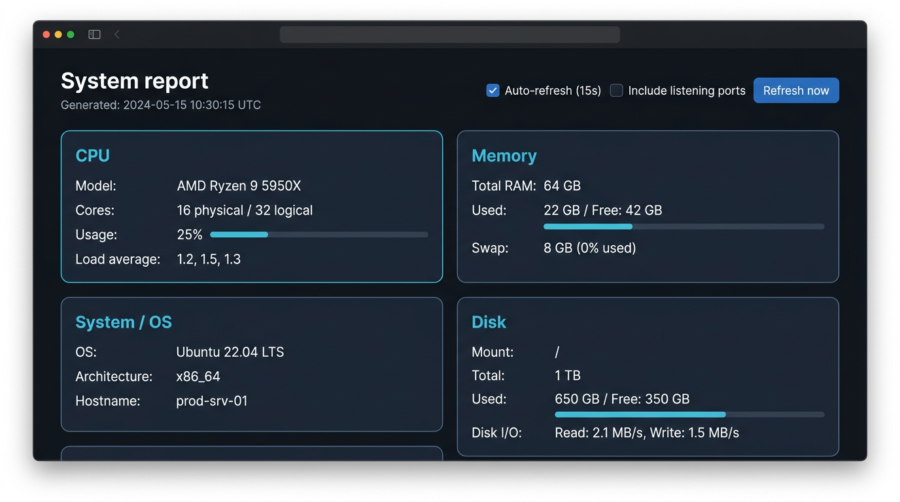

# SystemReports

Cross-platform system metrics with a **local web dashboard** (Windows, macOS, Linux) and optional CLI/JSON output.

- **GitHub:** [github.com/sriramsreedhar/systemreports](https://github.com/sriramsreedhar/systemreports.git)
- **License:** [Apache-2.0](LICENSE)

## Screenshot



The UI shows CPU, memory, OS, disk (including I/O), network (interfaces, traffic, optional listening ports), top processes, and uptime. Use **Refresh now** or enable **Auto-refresh** to keep values current.

## Features

- **Web dashboard** — Run `systemreports` and open the URL in your browser (default: `http://127.0.0.1:5050/`).
- **CLI / JSON** — `systemreports --cli` for a text summary; `systemreports --json` for full JSON.
- **Legacy** — Original CentOS-oriented script: `legacy_cli.py` (Unix-oriented).

**Requirements:** Python 3.8+, [psutil](https://github.com/giampaolo/psutil), [Flask](https://flask.palletsprojects.com/).

## Install

```bash
pip install -e .
# or
pip install systemreports
```

## Run the dashboard

```bash
systemreports
```

Other useful options:

```bash
# Do not open a browser automatically
systemreports --no-browser

# Listen on all interfaces (use only on trusted networks)
systemreports --host 0.0.0.0 --port 5050
```

## API

- `GET /api/report` — JSON snapshot (includes listening ports when permitted).
- `GET /api/report?ports=0` — Skip port enumeration (fewer permission prompts).

You can also run the module directly: `python -m systemreports`.

## More detail

See [README.rst](README.rst) for the original project notes and older pip/output examples.
